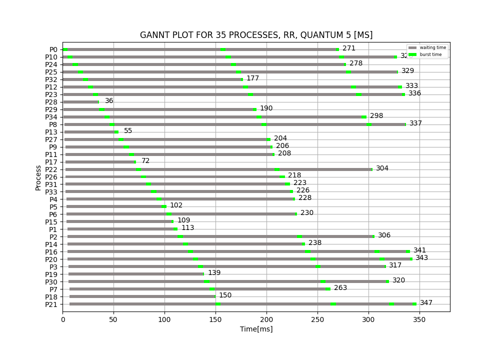
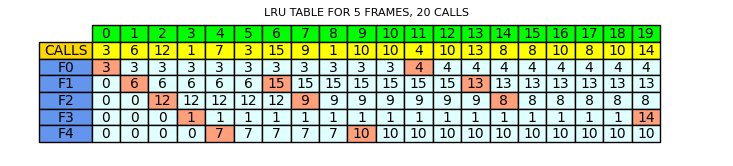

# scheduling_algorithms

## Abstract
Project presenting selected algorithms for processes allocation and pages replacement.

The part needed for the studies were the algorithms themselves, but as part of my creative and independent work (and for portfolio too), I decided to tweak the project a bit.
The result of this work are mainly graphs of scalable size generated for algorithms. I was using matplotlib for this (available in requirements.txt).

## Content
Project consists of: 
 * config file
 * one main file
 * two subfiles (one for the processes and pages replacement algorithms, each)
 * four algorithms each in a single file
 * Process and Frame class each in single file
 * matplotlib graphs (same as subfiles each)
 * generator 
 * utilities 
 
 ## Manual
 * Set the appropriate values of the configuration parameters in config.py as needed.
   * By using parameters from the ["EXE"], you can define exactly which algorithms will be executed and which files will be saved (or not)
    ```python
        "EXE": {
        # decision parameters - working like a switch
        # one can decide what want to run
        "RR": 1,
        "FCFS": 1,
        "FIFO": 1,
        "LRU": 1,
        # whether save txt files
        "TXT": 0,
        # whether save graphs
        "GRAPHS": 1,
        },
    ```
 * Go to main.py and just run
    ```python
    if __name__ == '__main__':
      check_config(cfg)
      if cfg["EXE"]["RR"]:
          case_rr(timestamp)
      if cfg["EXE"]["FCFS"]:
          case_fcfs(timestamp)
      if cfg["EXE"]["FIFO"]:
          case_fifo(timestamp)
      if cfg["EXE"]["LRU"]:
          case_lru(timestamp)
    ```
 * If you have chosen to save files, then folder will be created with the name corresponding to the current time in given format
    in the same directory as project (same with every file - timestamp is a subfix) 
    ```python
    timestamp = time.strftime("%Y-%m-%d_%H-%M-%S")
    ```
## Outcome
Here is what you can expect from the project: 
 * results of the algorithms saved to .txt files (example: FCFS algorithm)
```
PID 	 ARRIVAL 	 DURATION 	 WAITING 	 START 	 	 TERMINATION 
2 	0 ms	 	11 ms		 0 ms 		  0 ms 		11 ms 
18 	0 ms	 	28 ms		 11 ms 		  11 ms 		39 ms 
21 	0 ms	 	12 ms		 39 ms 		  39 ms 		51 ms 
12 	1 ms	 	27 ms		 50 ms 		  51 ms 		78 ms 
23 	1 ms	 	19 ms		 77 ms 		  78 ms 		97 ms 
0 	2 ms	 	24 ms		 95 ms 		  97 ms 		121 ms 
13 	2 ms	 	4 ms		 119 ms 		121 ms 		125 ms 
4 	3 ms	 	26 ms		 122 ms 		125 ms 		151 ms 
16 	3 ms	 	20 ms		 148 ms 		151 ms 		171 ms 
19 	3 ms	 	27 ms		 168 ms 		171 ms 		198 ms 
6 	4 ms	 	20 ms		 194 ms 		198 ms 		218 ms 
14 	4 ms	 	18 ms		 214 ms 		218 ms 		236 ms 
24 	4 ms	 	18 ms		 232 ms 		236 ms 		254 ms 
5 	5 ms	 	9 ms		 249 ms 		254 ms 		263 ms 
8 	5 ms	 	20 ms		 258 ms 		263 ms 		283 ms 
7 	6 ms	 	29 ms		 277 ms 		283 ms 		312 ms 
15 	6 ms	 	9 ms		 306 ms 		312 ms 		321 ms 
22 	6 ms	 	11 ms		 315 ms 		321 ms 		332 ms 
1 	7 ms	 	17 ms		 325 ms 		332 ms 		349 ms 
10 	7 ms	 	14 ms		 342 ms 		349 ms 		363 ms 
11 	7 ms	 	13 ms		 356 ms 		363 ms 		376 ms 
17 	7 ms	 	29 ms		 369 ms 		376 ms 		405 ms 
9 	8 ms	 	17 ms		 397 ms 		405 ms 		422 ms 
3 	9 ms	 	16 ms		 413 ms 		422 ms 		438 ms 
20 	9 ms	 	28 ms		 429 ms 		438 ms 		466 ms 


Average wait time: 220.2 	Std: 132.159 
```
 * chart presenting the process allocation (example: Round-Robin algorithm)
 

 * list of calls (example: calls generated for FIFO algorithm) 
```
CALLS:      4     10     2     3     8     12     19     18     18     11     3     11     19     9     1     7     12     9     6     19     20     17     5     5     8     18     15     2     18     12     
```
 * table presenting pages replacement process (example: LRU algorithm)
 
